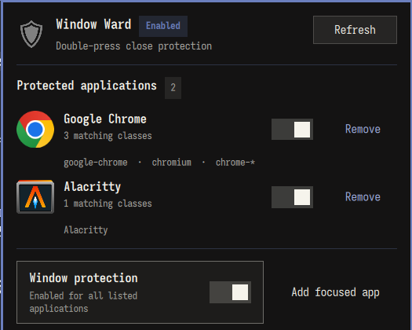

# Window Ward

Window Ward protects selected applications from an accidental `Super+W`. The first press warns;
pressing the shortcut again on the same window within the configured interval closes it normally.



## Requirements

- Verified with Omarchy 4.0.1 / Hyprland 0.56.2
- Python 3.10 or newer and hyprctl

## Install

```sh
omarchy plugin add https://github.com/r404r/omarchy-window-ward.git --enable
~/.config/omarchy/plugins/io.github.r404r.window-ward/scripts/setup
hyprctl reload
hyprctl configerrors
```

The second command is intentionally explicit: Omarchy plugins do not have install hooks. It adds a
small marked block to the user-owned Hyprland bindings and backs the file up first.
It refuses to replace an existing `~/.local/bin/window-ward` file or a modified managed block.

## Configure

```sh
window-ward list
window-ward add-focused "My application"
window-ward set-app-enabled application-id false  # or: true
window-ward remove application-id
window-ward timeout 3000
window-ward enable   # or: disable
window-ward doctor
```

Configuration is stored at `~/.config/window-ward/config.json`. Matching uses window class and
initialClass; Window Ward never needs browser URLs, profiles, titles, passwords or tokens.
Configuration input is capped at 48 KiB and the `status` JSON response at 64 KiB.
The panel resolves each icon automatically from the application rule ID, then its exact class and
initialClass values, using the active system icon theme; a generic application icon is the final fallback.
Each list row can be paused independently or removed after a second confirmation click.

## Remove

```sh
~/.config/omarchy/plugins/io.github.r404r.window-ward/scripts/uninstall
omarchy plugin remove io.github.r404r.window-ward
hyprctl reload
```

Always run `uninstall` **before** `omarchy plugin remove`; otherwise the global binding points to a
removed plugin. If the repository was removed first, remove the marked `WINDOW WARD` block from
`~/.config/hypr/bindings.lua`, then run `hyprctl reload`. The uninstall script preserves application rules.
Also remove a dangling installer link only after verifying that it is a symlink:

```sh
[[ -L ~/.local/bin/window-ward ]] && rm ~/.local/bin/window-ward
```

## Development

```sh
tests/test-window-ward.sh
tests/test-setup.sh
python -B bin/window-ward --help >/dev/null
cache_dir=$(mktemp -d); trap 'rm -rf "$cache_dir"' EXIT; PYTHONPYCACHEPREFIX="$cache_dir" python -m py_compile scripts/window_ward_integration.py scripts/setup scripts/uninstall
bash -n tests/*.sh
omarchy plugin validate "$PWD"
QMLLINT=${QMLLINT:-/usr/lib/qt6/bin/qmllint}
"$QMLLINT" -I "$OMARCHY_PATH/shell" BarWidget.qml Panel.qml
```

Omarchy's `qs.*` modules are resolved by Quickshell at runtime, so standalone `qmllint` may report
unresolved-import warnings even with the correct import path. Treat those warnings as best-effort;
release validation also requires loading the plugin on the verified Omarchy version and checking logs.

See [CONTRIBUTING.md](CONTRIBUTING.md). Licensed under MIT.
